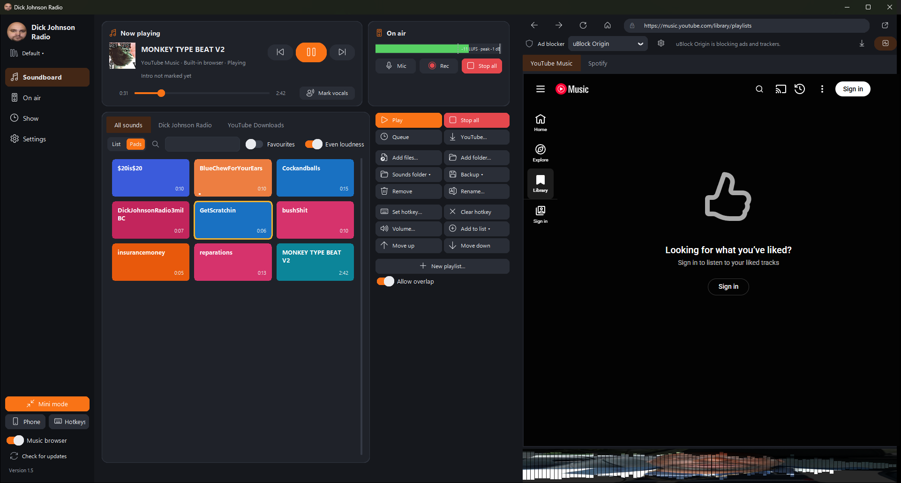
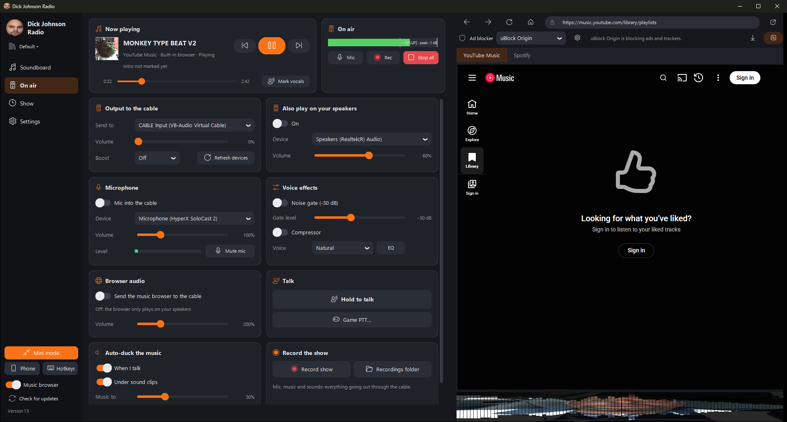
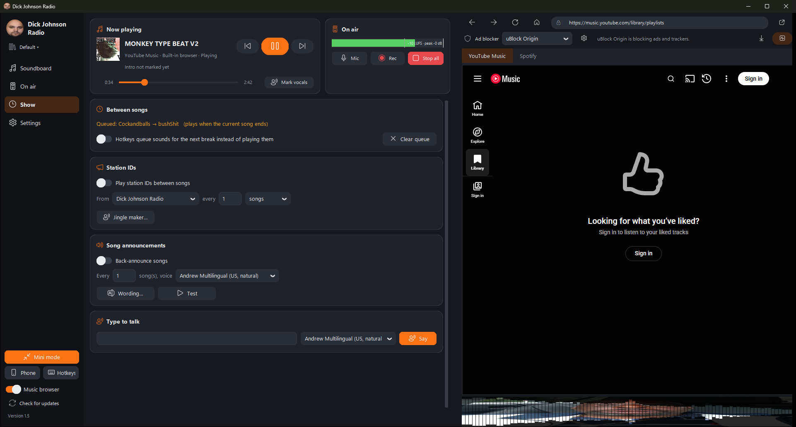
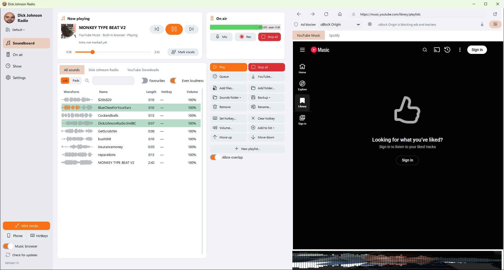
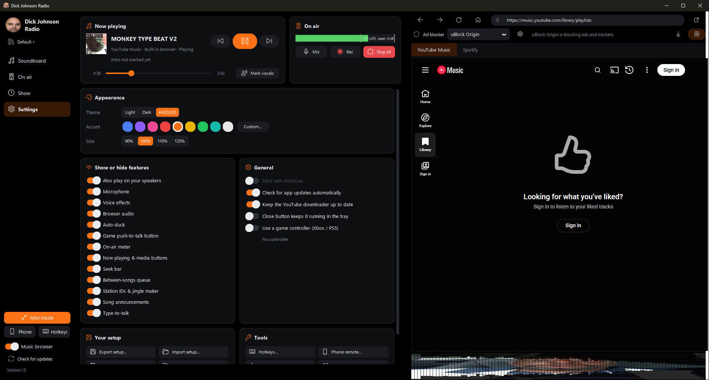
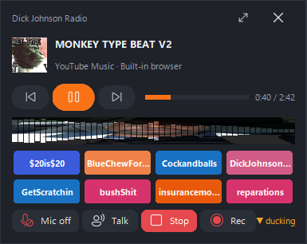
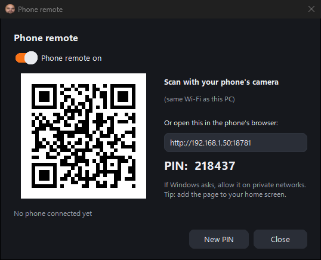

<p align="center">
  
</p>

<h1 align="center">Dick Johnson Radio</h1>

<p align="center">
  A Windows soundboard, media controller and one-person radio studio.<br>
  Fire clips with hotkeys or a game controller, play music from a built-in YouTube Music / Spotify browser,
  and send everything (mic included) out through a virtual audio cable.
</p>

<p align="center"><a href="https://github.com/JickDohnson/Dick-Johnson-Radio-Public/releases/latest"><b>⬇ Download the latest version</b></a></p>

---

## Screenshots

<p align="center">
  
  <br><sub>The Soundboard page, with now playing, the on-air meter and the built-in YouTube Music browser</sub>
</p>

<table>
  <tr>
    <td width="50%"><br><sub><b>On air</b>: cable output and boost, speakers, mic, voice effects, talk and Game PTT</sub></td>
    <td width="50%"><br><sub><b>Show</b>: between-songs queue, station IDs, announcements, type-to-talk</sub></td>
  </tr>
  <tr>
    <td><br><sub>Light theme, list view with waveforms</sub></td>
    <td><br><sub><b>Settings</b>: theme, accent colour, size, and which features are shown (AMOLED black theme)</sub></td>
  </tr>
  <tr>
    <td align="center"><br><sub>Mini mode: a small always-on-top remote</sub></td>
    <td align="center"><br><sub>Phone remote: scan the QR code to control the show from your phone</sub></td>
  </tr>
</table>

## Features

### Soundboard
- Add audio files (WAV, MP3, OGG, FLAC, AIFF) and play them with **global hotkeys** that work even when the app isn't focused
- **Xbox and PS5 (DualSense) controller** support, including combos like `LB + A`, over USB or Bluetooth
- **List view with waveform previews** that fill in as a sound plays, or a **pad view** of big coloured buttons
- **Search** (Ctrl+F) and **favourites** (★)
- Per-sound volume, overlap on/off, **Even loudness** (every clip plays at about the same level)
- **Clip effects**: speed (chipmunk / slow-mo), reverse and echo, saved per sound or for a single play
- **Sound packs**: share sounds as a `.djrpack` file (names, colours, volumes, effects) and import them in one go
- **Profiles**: separate sound sets, playlists, hotkeys and show settings, e.g. one per show
- **Playlists** as tabs, with loop, shuffle, skip and their own hotkeys

### Music & media
- **Built-in browser** with tabs for YouTube Music and Spotify; logins are remembered
- **uBlock Origin** ad blocking built in (or uBlock Origin Lite)
- Media controls for the built-in browser: play/pause, next, previous and a **seek bar**
- **Album art** in the now-playing area
- **Audio visualizer** in 5 styles (Bars, LED, Mirror, Wave, Mountain), with **your own picture** showing through the bars
- **YouTube → MP3 downloader**: songs or whole playlists go into their own playlist with album art, and the downloader can update itself when YouTube changes
- **YouTube clips**: grab just part of a video (e.g. 1:30 to 1:42, or press "now" while it plays) as a new sound

### On air
- Sends sounds to **VB-Audio Virtual Cable** (or any output), optionally mirrored to your speakers
- **Microphone** and **browser audio** mixed into the cable
- **Mic effects**: noise gate, compressor, voices (Radio, Telephone, Deep, Chipmunk, Robot) and a bass / mid / treble **equalizer**
- **Hold-to-talk / talk-over** button or hotkey: mic on, music ducked
- **Game push-to-talk**: one click (or a hotkey) holds your game's talk key down for you, and again lets go. Any key or mouse button 4/5, and it can hold the key automatically while sounds play
- **Auto-ducking**: music dips while you talk or a clip plays
- **On-air loudness meter** with peak and clip warning
- **Countdown to the vocals**: mark where the singing starts and get a countdown to talk over the intro (auto-estimated for downloaded songs)

### Between songs
- **Queue clips to play after the current song**, before the next one starts
- **Station IDs** every N songs or minutes
- **Song announcements** with natural-sounding AI voices (Microsoft neural voices) or the built-in Windows voices
- **Jingle maker**: type a line, pick a voice and a music bed, and it saves a station ID
- **Type-to-talk**: type a line, press Enter, and it's spoken on air in any voice

### Everything else
- **Record your show** to MP3 (everything going out through the cable)
- **Mini mode**: a small always-on-top remote with your favourite pads
- **Modern look**: a sidebar with Soundboard, On air, Show and Settings pages; light, dark or **AMOLED black** themes with any accent colour, and a size setting (90 to 125%)
- **Your layout**: show or hide any feature (Settings, or right-click a card's title); every hotkey in one **Hotkeys** window, or right-click a button to set its own
- **System tray** icon with quick controls, and an option to keep running in the tray when you close the window
- **Phone remote**: control the show from your phone's browser over your Wi-Fi (pads, now playing, mic, hold to talk, type-to-talk, recording, boost). Scan a QR code, PIN-protected, home network only
- **Cable boost** up to +18 dB with a limiter, and per-source sliders up to 800%, so the browser can be quiet on your speakers but loud on the cable
- **Sounds folder**: drop files in and they appear on the board. Added sounds are copied there, so the setup is portable
- **Backup**: export your whole setup (sounds, playlists, hotkeys, art, settings) to one zip and import it on another PC
- An **installer** (shortcuts, start with Windows, uninstall from Windows Settings), or one standalone exe that sets itself up in whatever folder you run it from
- **Automatic updates** for the app and the YouTube downloader

---

## Requirements

- **Windows 10 or 11, 64-bit**
- **[VB-Audio Virtual Cable](https://vb-audio.com/Cable/)** (free) to route audio into Discord, OBS and similar apps. Without it, sounds play on your speakers.
- **Microsoft Edge WebView2 Runtime** for the built-in browser. It comes with Windows 11; on Windows 10, get it from [Microsoft](https://developer.microsoft.com/microsoft-edge/webview2/) if the app says it's missing.
- **Windows 11** (or Windows 10 build 20348+) for *browser audio → cable* and the visualizer. Everything else works on older Windows 10.
- An internet connection for the built-in browser, the YouTube downloader and the natural AI voices

No Python or anything else to install. It's all inside the app.

## Install

### Option 1: installer (recommended)

1. Download **`Dick-Johnson-Radio-Setup.zip`** from the [latest release](https://github.com/JickDohnson/Dick-Johnson-Radio-Public/releases/latest) (about 110 MB).
2. Unzip it and run **`Dick-Johnson-Radio-Setup.exe`**.
3. Pick the options you want: Start Menu shortcut, Desktop shortcut, start with Windows. It installs for your Windows account only, with no admin rights needed.

Uninstall it any time from **Settings → Apps → Installed apps**. You choose whether your settings and sounds are kept.

### Option 2: just the exe (no install)

1. Download **`Dick-Johnson-Radio.exe`** from the [latest release](https://github.com/JickDohnson/Dick-Johnson-Radio-Public/releases/latest) (about 95 MB).
2. Put it in a folder you can write to, for example `Documents\Dick Johnson Radio`. Not `Program Files`.
3. Double-click it. The first launch takes about 20 seconds while it sets up the folder (settings, browser data, ad blocker).

**Windows SmartScreen** may say *"Windows protected your PC"* because the app isn't code-signed. Click **More info → Run anyway**. You can check your download against the SHA-256 checksum in the release notes.

Either way, everything the app saves lives in its own folder, so you can move or copy that folder to another PC.

## Phone remote

Click **Phone** at the bottom of the sidebar and switch it on. Scan the QR code with your phone's camera (the phone must be on the same Wi-Fi as the PC), or open the address shown in the phone's browser and enter the PIN. The first time, Windows asks whether to allow the app on private networks: click **Allow**. **New PIN** cuts off every phone that's connected. It's only reachable on your own network, never from the internet, and it's off until you switch it on.

## Updates

From version 1.1, the app updates itself, whether it was installed or run as a plain exe. It checks once a day, or when you click **Check for updates** at the bottom of the sidebar. When a new version is out, that button becomes **Update to x.y**. The download is checked against GitHub's published checksum, and it installs on restart or when you close the app. Your settings, sounds and logins are kept.

On 1.0? Download the latest exe once by hand and put it in place of the old one. After that, updates are automatic.

## First-time setup

1. Open the **On air** page. Under **Output to the cable**, set **Send to** to **CABLE Input (VB-Audio Virtual Cable)**. In Discord, OBS or similar, set your microphone to **CABLE Output**.
2. **Also play on your speakers:** switch it on and pick your speakers or headphones so you hear the sounds too.
3. **Microphone:** switch on **Mic into the cable** to send your real mic through the cable as well, with optional voice effects.
4. **Browser audio:** switch it on to send YouTube Music / Spotify through the cable.
5. On the **Soundboard** page, add sounds with **Add files…**, **Add folder…**, **YouTube…**, or by dropping files into the `sounds` folder.
6. Select a sound and click **Set hotkey…**. Press a key combo or a controller button.

Tips: right-click a hotkey button to clear it, right-click the visualizer to change its style or picture, and right-click sounds for favourites, colours and playlists.

## Troubleshooting

Run the built-in check from a Command Prompt in the app's folder:

```bash
"Dick-Johnson-Radio.exe" --selftest
```

This writes `selftest.txt` next to the exe, with OK/FAIL for audio devices, MP3 support, media controls, the YouTube downloader, the natural voices, the update feed, the phone remote, browser audio capture, the built-in browser, speech, controllers, the icons and the bundled files.

## Credits

Dick Johnson Radio bundles these open-source projects, unmodified:

- [uBlock Origin](https://github.com/gorhill/uBlock) by Raymond Hill (GPLv3)
- [yt-dlp](https://github.com/yt-dlp/yt-dlp) (Unlicense) and [FFmpeg](https://ffmpeg.org/) ([source](https://github.com/FFmpeg/FFmpeg), GPL build via [imageio-ffmpeg](https://github.com/imageio/imageio-ffmpeg))
- [edge-tts](https://github.com/rany2/edge-tts) for the natural voices
- [CustomTkinter](https://customtkinter.tomschimansky.com/) for the window
- [Python](https://www.python.org/), [sounddevice](https://python-sounddevice.readthedocs.io/), [soundfile](https://python-soundfile.readthedocs.io/), [pythonnet](https://pythonnet.github.io/) + Microsoft Edge WebView2, [keyboard](https://github.com/boppreh/keyboard), [hidapi](https://github.com/trezor/cython-hidapi), [Pillow](https://python-pillow.org/), NumPy, comtypes, PyWinRT

Only download and broadcast audio you have the rights to use.
