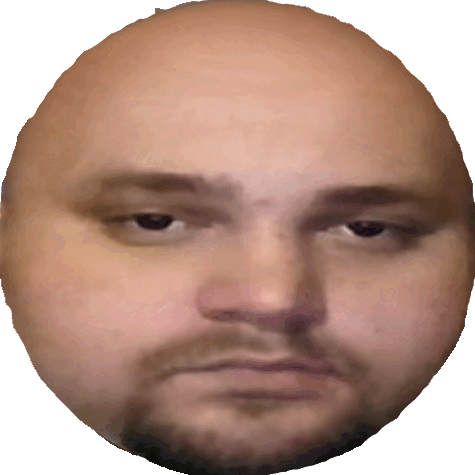

<p align="center">
  
</p>

<h1 align="center">Dick Johnson Radio</h1>

<p align="center">
  A Windows soundboard, media controller and one-person radio studio.<br>
  Fire clips with hotkeys or a game controller, play music from a built-in YouTube Music / Spotify browser,
  and send everything (mic included) out through a virtual audio cable.
</p>

<p align="center"><a href="https://github.com/JickDohnson/Dick-Johnson-Radio-Public/releases/latest"><b>⬇ Download Dick Johnson Radio 1.0</b></a></p>

---

## Features

### Soundboard
- Add audio files (WAV, MP3, OGG, FLAC, AIFF) and play them with **global hotkeys** that work even when the app isn't focused
- **Xbox and PS5 (DualSense) controller** support, including combos like `LB + A`, over USB or Bluetooth
- **List view with waveform previews** that fill in as a sound plays, or a **pad view** of big coloured buttons
- **Search** (Ctrl+F) and **favourites** (★)
- Per-sound volume, overlap on/off, **Even loudness** (every clip plays at about the same level)
- **Playlists** as tabs, with loop, shuffle, skip and their own hotkeys

### Music & media
- **Built-in browser** with tabs for YouTube Music and Spotify; logins are remembered
- **uBlock Origin** ad blocking built in (or uBlock Origin Lite)
- Media controls for the built-in browser: play/pause, next, previous and a **seek bar**
- **Album art** in the now-playing area
- **Audio visualizer** in 5 styles (Bars, LED, Mirror, Wave, Mountain), with **your own picture** showing through the bars
- **YouTube → MP3 downloader**: songs or whole playlists go into their own playlist with album art, and the downloader can update itself when YouTube changes

### On air
- Sends sounds to **VB-Audio Virtual Cable** (or any output), optionally mirrored to your speakers
- **Microphone** and **browser audio** mixed into the cable
- **Mic effects**: noise gate, compressor, and voices (Radio, Telephone, Deep, Chipmunk, Robot)
- **Hold-to-talk / talk-over** button or hotkey: mic on, music ducked
- **Auto-ducking**: music dips while you talk or a clip plays
- **On-air loudness meter** with peak and clip warning
- **Countdown to the vocals**: mark where the singing starts and get a countdown to talk over the intro (auto-estimated for downloaded songs)

### Between songs
- **Queue clips to play after the current song**, before the next one starts
- **Station IDs** every N songs or minutes
- **Song announcements** with natural-sounding AI voices (Microsoft neural voices) or the built-in Windows voices
- **Jingle maker**: type a line, pick a voice and a music bed, and it saves a station ID

### Everything else
- **Record your show** to MP3 (everything going out through the cable)
- **Mini mode**: a small always-on-top remote with your favourite pads
- Dark and light themes, multi-monitor aware
- **Sounds folder**: drop files in and they appear on the board. Added sounds are copied there, so the setup is portable
- **Backup**: export your whole setup (sounds, playlists, hotkeys, art, settings) to one zip and import it on another PC
- One standalone exe that sets itself up in whatever folder you run it from

---

## Requirements

- **Windows 10 or 11, 64-bit**
- **[VB-Audio Virtual Cable](https://vb-audio.com/Cable/)** (free) to route audio into Discord, OBS and similar apps. Without it, sounds play on your speakers.
- **Microsoft Edge WebView2 Runtime** for the built-in browser. It comes with Windows 11; on Windows 10, get it from [Microsoft](https://developer.microsoft.com/microsoft-edge/webview2/) if the app says it's missing.
- **Windows 11** (or Windows 10 build 20348+) for *browser audio → cable* and the visualizer. Everything else works on older Windows 10.
- An internet connection for the built-in browser, the YouTube downloader and the natural AI voices

No Python or anything else to install. It's all inside the exe.

## Install

1. Download **`Dick-Johnson-Radio.exe`** from the [latest release](https://github.com/JickDohnson/Dick-Johnson-Radio-Public/releases/latest) (about 90 MB).
2. Put it in a folder you can write to, for example `Documents\Dick Johnson Radio`. Not `Program Files`.
3. Double-click it. The first launch takes about 20 seconds while it sets up the folder (settings, browser data, ad blocker).

**Windows SmartScreen** may say *"Windows protected your PC"* because the app isn't code-signed. Click **More info → Run anyway**. You can check your download against the SHA-256 checksum in the release notes.

Everything the app saves lives next to the exe, so you can move or copy that whole folder to another PC.

## First-time setup

1. **Send sounds to:** pick **CABLE Input (VB-Audio Virtual Cable)**. In Discord, OBS or similar, set your microphone to **CABLE Output**.
2. **Also play on:** tick this and pick your speakers or headphones so you hear the sounds too.
3. **Microphone:** tick it to send your real mic through the cable as well, with optional effects.
4. **Browser audio:** tick it to send YouTube Music / Spotify through the cable.
5. Add sounds with **Add files…**, **Add folder…**, **YouTube…**, or by dropping files into the `sounds` folder.
6. Select a sound and click **Set hotkey…**. Press a key combo or a controller button.

Tips: right-click a hotkey button to clear it, right-click the visualizer to change its style or picture, and right-click sounds for favourites, colours and playlists.

## Troubleshooting

Run the built-in check from a Command Prompt in the app's folder:

```bash
"Dick-Johnson-Radio.exe" --selftest
```

This writes `selftest.txt` next to the exe, with OK/FAIL for audio devices, MP3 support, media controls, browser audio capture, the built-in browser, speech, controllers, the YouTube downloader and the bundled files.

## Credits

Dick Johnson Radio bundles these open-source projects, unmodified:

- [uBlock Origin](https://github.com/gorhill/uBlock) by Raymond Hill (GPLv3)
- [yt-dlp](https://github.com/yt-dlp/yt-dlp) (Unlicense) and [FFmpeg](https://ffmpeg.org/) ([source](https://github.com/FFmpeg/FFmpeg), GPL build via [imageio-ffmpeg](https://github.com/imageio/imageio-ffmpeg))
- [edge-tts](https://github.com/rany2/edge-tts) for the natural voices
- [Python](https://www.python.org/), [sounddevice](https://python-sounddevice.readthedocs.io/), [soundfile](https://python-soundfile.readthedocs.io/), [pythonnet](https://pythonnet.github.io/) + Microsoft Edge WebView2, [keyboard](https://github.com/boppreh/keyboard), [hidapi](https://github.com/trezor/cython-hidapi), [Pillow](https://python-pillow.org/), NumPy, comtypes, PyWinRT

Only download and broadcast audio you have the rights to use.
